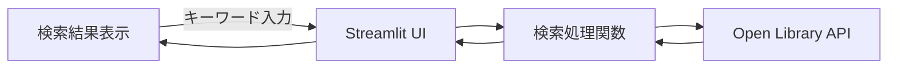
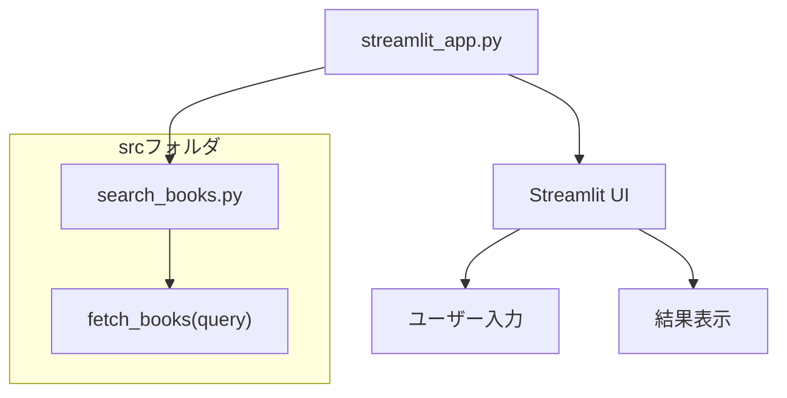

# BooKS API 書籍検索アプリ（課題2）

## アプリ概要
このアプリは **Open Library API** を使い、ユーザーが入力した検索キーワードに基づいて書籍情報を取得し、結果を画面に表示する Streamlit アプリです。  
- 検索結果として、タイトル・著者・初版年・リンクを表示  
- 認証不要・無料の API を使用  

### 使用 API
- Open Library API: `http://openlibrary.org/search.json?q={query}&limit=10`  
  （APIキー不要）

---

## システム設計図（Overview）


- A: ユーザー → 検索キーワードを入力
- B: Streamlit UI → 入力フォーム・検索ボタン・結果表示
- C: 検索処理関数 → APIにリクエストしてJSONを整形
- D: Open Library API → 書籍情報を返す

## コード説明図（Layout）


- search_books.py
  - fetch_books(query) 関数で API からデータ取得
- streamlit_app.py
  - Streamlit UI の作成
  - ユーザー入力 → 関数呼び出し → 結果表示
- 全てのファイルは notebook/<学籍番号>_<名字>/ に格納

## ディレクトリ構成例
```bash

notebook/
└─ 2301201_yamamoto/
   ├─ streamlit_app.py       # メイン UI
   ├─ src/
   │  └─ search_books.py    # API 呼び出し関数
   ├─ requirements.txt
   └─ README.md
```

## 実行方法
```bash
pip install -r requirements.txt
streamlit run streamlit_app.py
```

## 今後の拡張案

- 検索結果を CSV で保存
- 表形式で表示、ソート機能追加
- さらに複数 API を組み合わせて要約や推薦機能を追加

